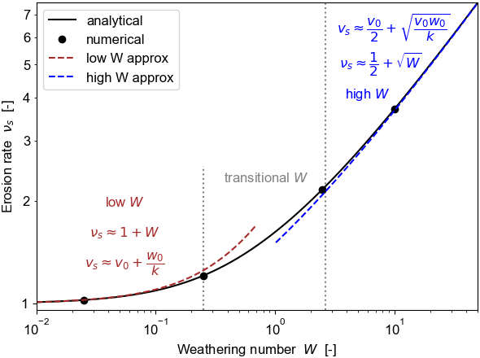

 .. py:module:: wme

Weathering-mediated erosion
################################################################

Exploration of weathering-driven weakening on rock erosion.

The focus is on environments with no soil accumulation such as on 
steep bedrock channel walls. 
The current treatment is 1d only, and for expository purposes it simplistically assumes 
an exponentially decaying weakening profile with depth into the rock.

-----------------------------------------------------------
Code
-----------------------------------------------------------

The `wme`_ code is provided as a :ref:`Python3 package <genindex>`
and a `Jupyter (IPython) notebook`_.

Set up & execution
-----------------------------------------------------------

 
.. toctree::
   :maxdepth: 1
   
   Prerequisites <documentation/prerequisites>
   Installation <documentation/install>
   Running <documentation/howtorun> 

.. toctree::
   :maxdepth: 1
   :hidden:
   
   modules/initialize   
   modules/symbols
   modules/data
   modules/theory
   modules/solve1d
   modules/solve1p1d
   modules/plot
   modules/save
  
.. only:: html 

..  _Python3 package: 
      https://github.com/cstarkjp/wme/tree/master/python
.. _Jupyter (IPython) notebook: 
      https://github.com/cstarkjp/wme/blob/master/experiments1d/wme1d.ipynb
.. _code: https://github.com/cstarkjp/wme
.. _wme: https://github.com/cstarkjp/wme
.. _example results: 
      https://github.com/cstarkjp/wme/blob/master/experiments1d/Results1d

