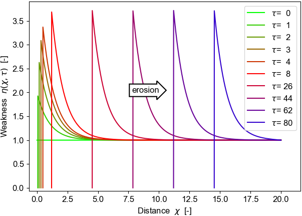

 .. py:module:: wme

Weathering-mediated erosion
################################################################

Exploration of weathering-driven weakening on rock erosion.

The focus is on environments with no soil accumulation: for example, on 
steep bedrock channel walls.

The current treatment is 1d only, and for expository purposes it simplistically assumes 
an exponentially decaying weakening profile with depth into the rock.

The `code`_ is provided as a `Python3 package`_ and an `IPython Jupyter notebook`_.

-----------------------------------------------------------
Installation
-----------------------------------------------------------

 
.. toctree::
   :glob:
   :maxdepth: 1
   
   Prerequisites <documentation/prerequisites>
   Git cloning and setting the PYTHONPATH <documentation/install>

-----------------------------------------------------------
Execution
-----------------------------------------------------------

 
.. toctree::
   :glob:
   :maxdepth: 1
   
   How to compute 1d solutions <documentation/howtorun> 

-----------------------------------------------------------
Python package
-----------------------------------------------------------

The :mod:`wme` Python package consists of the following modules:

.. toctree::
   :maxdepth: 1

   modules/initialize   
   modules/symbols
   modules/data
   modules/theory
   modules/solve1d
   modules/solve1p1d
   modules/plot
   modules/save
  
.. only:: html 

* :ref:`genindex` of modules, methods and variables

..  _Python3 package: 
      https://github.com/cstarknyc/WeatheringMediatedErosion/tree/master/python
.. _IPython Jupyter notebook: 
      https://github.com/cstarknyc/WeatheringMediatedErosion/blob/master/experiments1d/WeatheringMediatedErosion1d.ipynb
.. _code: https://github.com/cstarknyc/WeatheringMediatedErosion
.. _example results: 
      https://github.com/cstarknyc/WeatheringMediatedErosion/blob/master/experiments1d/Results1d

